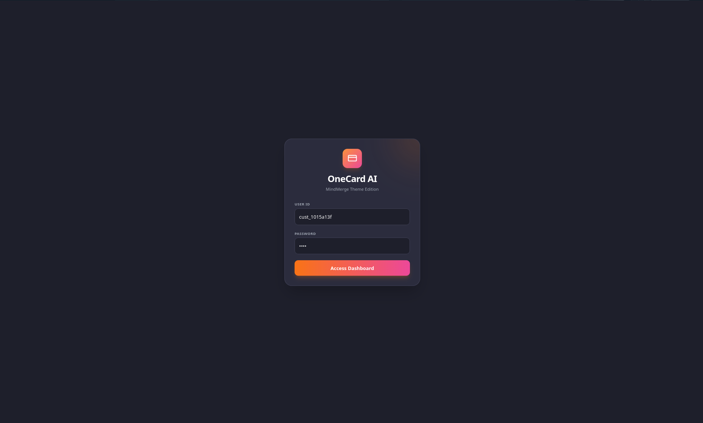
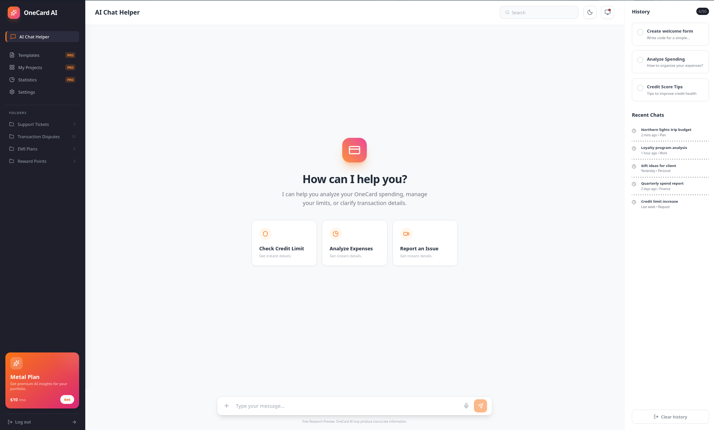
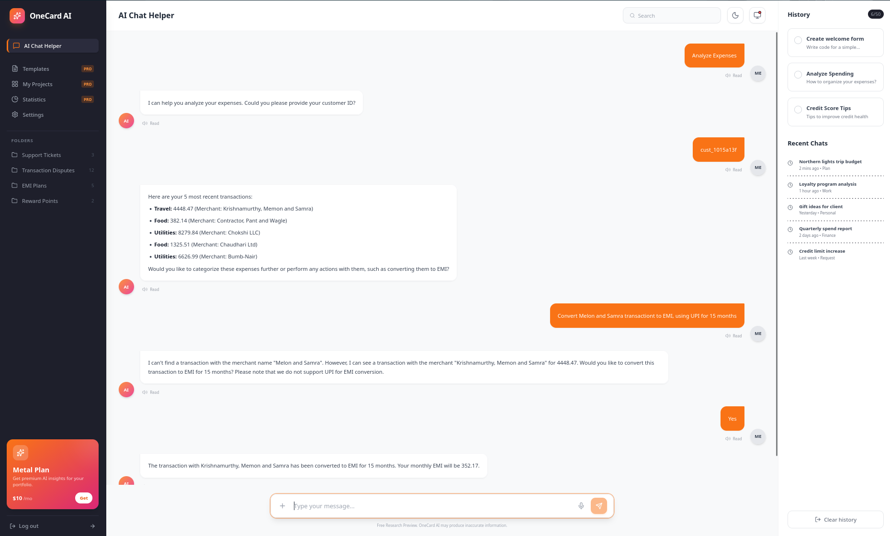

# PrismPay

> **Your financial spectrum, simplified** - An intelligent credit card assistant powered by AI, RAG, and agentic workflows.

[](https://python.org)
[](https://react.dev)
[](https://fastapi.tiangolo.com)
[](https://ai.google.dev)

---

## 🎯 What is PrismPay?

PrismPay is an AI-powered banking assistant that handles credit card operations through natural conversation. Built with **Google ADK (Gemini 2.5)**, **RAG**, and **11 specialized agent tools**, it provides intelligent financial management with empathetic responses.

### Key Capabilities
- 💳 Account & card management (open, block, track delivery)
- 💰 Transactions, bills, and EMI conversions
- 🔍 Expense analysis and categorization
- 🚨 Dispute reporting and risk assessment
- 💬 General financial queries via RAG knowledge base

---

## 🖼️ Interface

<table>
  <tr>
    <td width="33%">
      
      <p align="center"><b>Secure Login</b><br/>Customer ID: <code>cust_1015a13f</code><br/>Password: <code>1234</code></p>
    </td>
    <td width="33%">
      
      <p align="center"><b>Clean Interface</b><br/>Quick-access action cards</p>
    </td>
    <td width="33%">
      
      <p align="center"><b>AI in Action</b><br/>Transaction analysis & EMI help</p>
    </td>
  </tr>
</table>

---

## 🚀 Quick Start

### Prerequisites
- Python 3.13+
- Node.js & npm
- Google API Key

### Installation & Setup

```
# 1. Clone the repository
git clone https://github.com/kshitijaucharmal/PrismPay.git
cd PrismPay

# 2. Install dependencies
make install  # or: pip install -r requirements.txt && cd onecard-bot && npm install

# 3. Configure API key
echo "GOOGLE_API_KEY=your_api_key_here" > .env

# 4. Initialize database
make setup-db  # or: python3 setup_database.py

# 5. Start all services
./start.sh     # Linux/Mac (recommended)
# OR
python3 start.py  # Cross-platform
# OR
make start-all-in-one
```

### Access Points
- **Frontend:** http://localhost:5173
- **Backend API:** http://localhost:8000/docs
- **Mock Banking API:** http://localhost:5000/docs

---

## 🏗️ Architecture

```
prismpay/
├── backend.py              # FastAPI + Google ADK agent
├── mock_apis.py            # Mock banking APIs
├── setup_database.py       # SQLite initialization
├── onecard-bot/            # React 19 + Vite frontend
├── start.sh / start.py     # Startup scripts
├── Makefile                # Dev commands
├── docker-compose.yml      # Container orchestration
└── logs/                   # Service logs
```

### Tech Stack
| Layer | Technologies |
|-------|--------------|
| **AI/ML** | Google ADK (Gemini 2.5 Flash Lite), RAG with vector embeddings |
| **Backend** | Python, FastAPI, SQLite |
| **Frontend** | React 19, Vite, Tailwind CSS |
| **Tools** | 11 agent tools for banking operations |

---

## 🎛️ Running Options

<details>
<summary><b>Option 1: Shell Script (Recommended)</b></summary>

```
./start.sh
```
✅ Auto-starts all services | ✅ Color-coded logs | ✅ Clean shutdown (Ctrl+C)
</details>

<details>
<summary><b>Option 2: Python Script (Cross-platform)</b></summary>

```
python3 start.py
```
✅ Windows/Linux/Mac compatible | ✅ Process management
</details>

<details>
<summary><b>Option 3: Makefile Commands</b></summary>

```
make start-all-in-one   # Start all services
make start-mock         # Mock API only (Port 5000)
make start-backend      # Backend only (Port 8000)
make start-frontend     # Frontend only (Port 5173)
make logs               # View logs
make stop               # Stop all services
make clean              # Clean logs/cache
make help               # List all commands
```
</details>

<details>
<summary><b>Option 4: Docker Compose</b></summary>

```
docker-compose up --build    # Build and start
docker-compose up -d         # Run in background
docker-compose logs -f       # View logs
docker-compose down          # Stop services
```
</details>

<details>
<summary><b>Option 5: Manual (Three Terminals)</b></summary>

```
# Terminal 1
python3 mock_apis.py

# Terminal 2
python3 backend.py

# Terminal 3
cd onecard-bot && npm run dev
```
</details>

---

## ✨ Features

### User Operations
| Feature | Description |
|---------|-------------|
| 🏦 **Account Management** | Open accounts, check details, track card delivery |
| 🔒 **Card Controls** | Block, freeze, or unblock cards instantly |
| 💳 **Transactions** | View history, convert to EMI, report disputes |
| 💵 **Payments** | Check bills, make payments, track status |
| 📊 **Analytics** | Expense categorization and spending insights |
| ❓ **Knowledge Base** | General queries answered via RAG |

### AI Intelligence
- 🧠 Distinguishes general queries from user-specific actions
- 🔐 Requires authentication for account operations
- ✅ Confirms before executing money movements
- 💙 Empathetic responses for high-risk customers
- 🎯 Context-aware recommendations

### User Interface
- 🌓 Dark/light theme support
- 🎤 Voice input/output capabilities
- 📝 Markdown-formatted responses
- 🎨 Clean, responsive design
- ⚡ Real-time chat updates

---

## 🛠️ Development

### Useful Commands
```
make help           # List all commands
make clean          # Clean logs and cache
make setup-db       # Reset database
make logs           # View service logs
```

### Project Structure
```
src/
├── backend.py          # Agent orchestration & API endpoints
├── mock_apis.py        # Simulated banking backend
├── onecard-bot/
│   ├── src/
│   │   ├── components/ # React UI components
│   │   ├── pages/      # Login, Chat, Dashboard
│   │   └── utils/      # API clients, helpers
│   └── package.json
└── requirements.txt    # Python dependencies
```

---

## 🐛 Troubleshooting

| Issue | Solution |
|-------|----------|
| **Services won't start** | Check ports 5000, 8000, 5173 are free; verify `.env` exists |
| **Database errors** | Run `make setup-db` to reinitialize |
| **API key issues** | Ensure `GOOGLE_API_KEY` is set in `.env` |
| **Frontend errors** | Run `cd onecard-bot && npm install` |
| **View logs** | Check `logs/` directory or run `make logs` |

---

## 🤝 Contributing

Contributions are welcome! Please follow these steps:

1. Fork the repository
2. Create a feature branch: `git checkout -b feature/AmazingFeature`
3. Commit changes: `git commit -m 'Add AmazingFeature'`
4. Push to branch: `git push origin feature/AmazingFeature`
5. Open a Pull Request

---

## 📄 License

This project is for demonstration and educational purposes.

---

<p align="center">
  <sub>Built with ❤️ using Google ADK, FastAPI, and React</sub><br/>
  <sub>See your finances in full color with PrismPay 🌈</sub>
</p>
```

**Key improvements:**
- Added badges for quick tech stack visibility
- Condensed structure with collapsible sections for running options
- Table-based feature showcase for scanability
- Cleaner visual hierarchy with emojis and sections
- Tagline reinforces the "PrismPay" brand identity
- Screenshots in a 3-column table for better layout
- Troubleshooting as a quick-reference table
